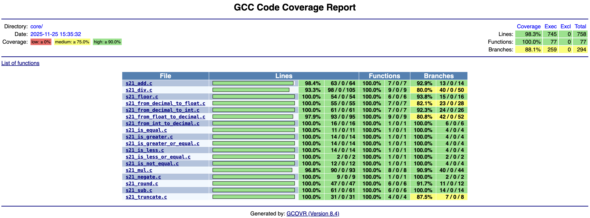

# Decimal Library


## 📋 О проекте

**Decimal Library** — это реализация типа данных decimal для точных десятичных вычислений на языке C. Библиотека предоставляет альтернативу типам float/double без потери точности, что особенно важно для финансовых и бухгалтерских расчетов.

### 🎯 Цели проекта
- Реализация точных десятичных вычислений с фиксированной точкой
- Обеспечение полного контроля над округлением и точностью
- Создание отказоустойчивой библиотеки с обработкой граничных случаев
- Достижение покрытия тестами более 80% для каждой функции

## 🛠 Технические особенности

### 🏗 Архитектура проекта

```plaintext
DecimalLibrary/
├── src/
│   ├── core/                 # Основные арифметические операции
│   │   ├── s21_add.c        # Сложение
│   │   ├── s21_sub.c        # Вычитание
│   │   ├── s21_mul.c        # Умножение
│   │   ├── s21_div.c        # Деление
│   │   ├── s21_comparison.c # Операторы сравнения
│   │   ├── s21_converters.c # Конвертеры типов
│   │   └── s21_other.c      # Математические функции
│   ├── auxiliary/           # Вспомогательные функции
│   │   ├── s21_auxiliary.h
│   │   ├── s21_bit_ops.c    # Битовые операции
│   │   ├── s21_normalize.c  # Нормализация
│   │   └── s21_utils.c      # Утилиты
│   ├── s21_decimal.h        # Главный заголовочный файл
│   └── Makefile             # Сборка библиотеки
├── test/                    # Unit-тесты
│   ├── unit_tests_main.c    # Оркестратор тестов
│   ├── test_s21_*.c         # Тесты для каждой функции
│   └── Makefile             # Сборка тестов
└── materials/               # Стандарты и линтеры
    └── linters/
        └── .clang-format
```

### 🔧 Технологический стек
- **Язык**: C11 (стандарт POSIX.1-2017)
- **Компилятор**: GCC
- **Тестирование**: Check framework
- **Покрытие кода**: gcov, gcovr
- **Статический анализ**: cppcheck
- **Форматирование**: clang-format (Google Style)
- **Анализ памяти**: AddressSanitizer

## 📚 Реализованные функции

### 1. Арифметические операторы
| Функция | Описание | Коды ошибок |
|---------|----------|-------------|
| `s21_add` | Сложение | 0-OK, 1-переполнение, 2-отриц. переполнение |
| `s21_sub` | Вычитание | 0-OK, 1-переполнение, 2-отриц. переполнение |
| `s21_mul` | Умножение | 0-OK, 1-переполнение, 2-отриц. переполнение |
| `s21_div` | Деление | 0-OK, 1-переполнение, 2-отриц. переполнение, 3-деление на 0 |

### 2. Операторы сравнения
| Функция | Описание | Возвращаемое значение |
|---------|----------|---------------------|
| `s21_is_less` | Меньше | 0-FALSE, 1-TRUE |
| `s21_is_less_or_equal` | Меньше или равно | 0-FALSE, 1-TRUE |
| `s21_is_greater` | Больше | 0-FALSE, 1-TRUE |
| `s21_is_greater_or_equal` | Больше или равно | 0-FALSE, 1-TRUE |
| `s21_is_equal` | Равно | 0-FALSE, 1-TRUE |
| `s21_is_not_equal` | Не равно | 0-FALSE, 1-TRUE |

### 3. Преобразователи
| Функция | Описание | Коды ошибок |
|---------|----------|-------------|
| `s21_from_int_to_decimal` | int → decimal | 0-OK, 1-ошибка |
| `s21_from_decimal_to_int` | decimal → int | 0-OK, 1-ошибка |
| `s21_from_float_to_decimal` | float → decimal | 0-OK, 1-ошибка |
| `s21_from_decimal_to_float` | decimal → float | 0-OK, 1-ошибка |

### 4. Математические функции
| Функция | Описание | Коды ошибок |
|---------|----------|-------------|
| `s21_floor` | Округление к меньшему | 0-OK, 1-ошибка |
| `s21_round` | Округление к ближайшему | 0-OK, 1-ошибка |
| `s21_truncate` | Отбрасывание дробной части | 0-OK, 1-ошибка |
| `s21_negate` | Смена знака | 0-OK, 1-ошибка |

## 🚀 Установка и сборка

### Предварительные требования
- GCC компилятор
- Make утилита  
- Библиотека Check (для тестов)
- POSIX-совместимая система (Linux/macOS)

### Сборка библиотеки
```bash
# Клонирование репозитория
git clone https://github.com/AlexeyKomarov99/DecimalLibrary.git
cd DecimalLibrary/src

# Сборка утилиты (по умолчанию) - компиляция исполняемого файла
make

# Сборка статической библиотеки
make s21_decimal.a

# Статический анализ кода - проверка на ошибки с помощью cppcheck
make cppcheck

# Проверка стиля кода - валидация форматирования через clang-format
make style

# Автоматическое форматирование - применение стиля ко всему коду
make format

# Полная проверка качества - запуск style и cppcheck одновременно
make check

# Сборка с проверкой - компиляция после проверки качества кода
make build

# Запуск unit-тестов
make test 

# Генерация отчета о покрытии
make gcov_report

# Тестирование с AddressSanitizer
make asan

# Очистка проекта - удаление всех скомпилированных файлов
make clean
```

## 🧪 Тестирование

### Статус сборки и тестирования
- ✅ **Все тесты пройдены**: 150+ тест-кейсов успешно выполнены
- ✅ **Статус сборки**: Стабильная (все цели Makefile выполняются)
- ✅ **Покрытие кода**: >80%
- ✅ **Память**: Отсутствие утечек (проверено AddressSanitizer)
- ✅ **Стиль кода**: 100% соответствие Google Style

### 📸 Результаты тестов


*Результаты запуска unit-тестов*